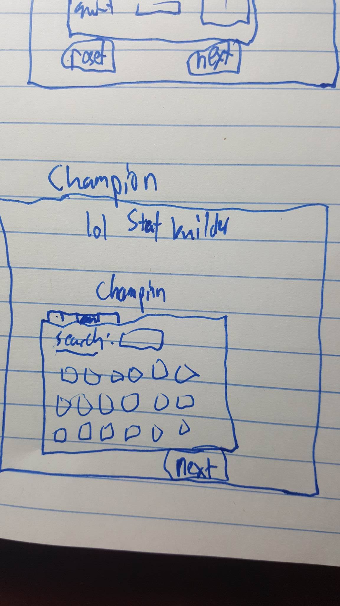

# League of Stat Building

> League of Stat Building will be a League of Legends application that allows a person to try out different combinations of runes, masteries, and items for a specific character to optimize their in-game stats.

### Installation:

### API Endpoints:

### Technologies Used:
MEAN stack, Javascript, Html, Bootstrap, CSS, and the League of Legends [API](https://developer.riotgames.com/api-methods/#lol-static-data-v3/GET_getItemList)

### Process:
[Trello](https://trello.com/b/cWwcNknZ/project-4)

There is going to be a static page for each model: Mastery, Rune, Champion, and Item. Once a user picks out each one the math will all add together with the power of magic (or what I'm pretty much going to spend a long time trying to figure out the code for).

An MVP will be to successfully build out each model and start linking up the stats from each model. There is a lot of math due to scaling stats for certain things so I expect this project as a whole will take a lot longer than the 6 days before the presentation.

**WireFrames:**  
Index:  
  
  
  Runes:
    
    
  Masteries:
    
    
  Champion Select:
    
    
  Items:
  

**ERD:**  

###Next Steps:

###Unsolved Problems:

