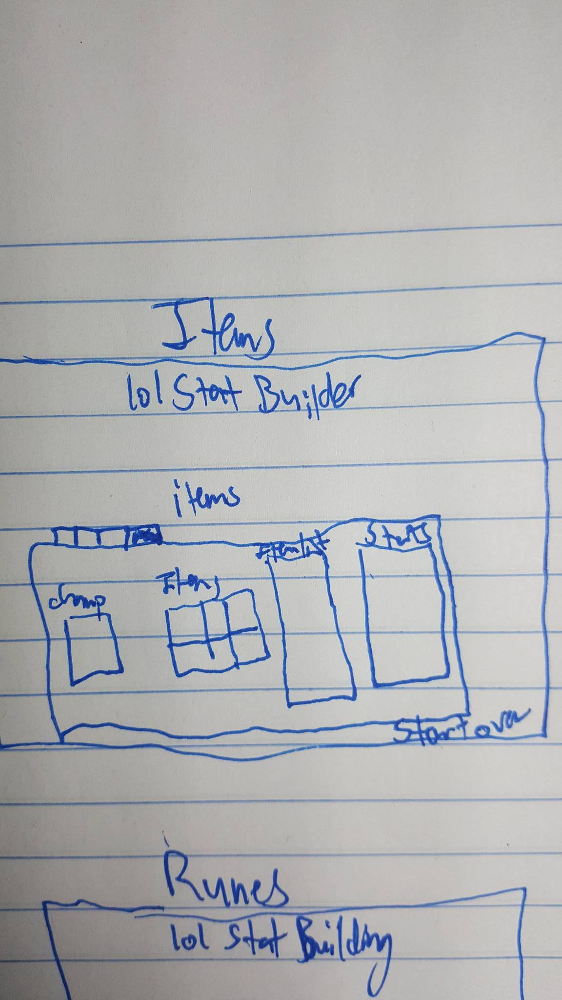

# League of Stat Building

> League of Stat Building will be a League of Legends application that allows a person to try out different combinations of runes, masteries, and items for a specific character to optimize their in-game stats.

### Installation:

### API Endpoints:

### Technologies Used:
MEAN stack, Javascript, Html, Bootstrap, CSS, and the League of Legends [API](https://developer.riotgames.com/api-methods/#lol-static-data-v3/GET_getItemList)

### Process:
[Trello](https://trello.com/b/cWwcNknZ/project-4)

Why I want to make this app?

This is one of the most popular games in the world and yet has very few applications outside of itself to optimize the experience. The purpose of this app would be to add an additional function to the game and benefit the player experience.

There is going to be a static page for each model: Mastery, Rune, Champion, and Item. Once a user picks out each one the math will all add together with the power of magic (or what I'm pretty much going to spend a long time trying to figure out the code for).

An MVP will be to successfully build out each model and start linking up the stats from each model. There is a lot of math due to scaling stats for certain things so I expect this project as a whole will take a lot longer than the 6 days before the presentation.

### Installation:

1. Clone or download this repository to your machine.
2. Confirm you have `Node.js` installed by running `node -v`.

> If you aren't getting a version number, head over to https://nodejs.org/en/download/ and download it.

3. `cd` into the root of your local copy of the app and run `npm install`.
4. Start the database server with `mongod`.
5. Start the server with `nodemon` or `node server.js`.
6. Navigate to `localhost:3000`, and you're good to go!

### Unsolved Problems:

On the rune page I am still working to pull out the statistical data based on the selected runes to show the base stats added together so a User can see specifically the results of their rune choices.  Further work down the road will be to make the site more engaging from a style standpoint as well as beginning to work on the other 3 pages so the application is fully functional for a player to theorycraft builds before getting into the game.

**WireFrames:**  
Index:  
  

  Runes:  
    

  Masteries:  
    

  Champion Select:  
    

  Items:  
  

**ERD:**    

###Next Steps:

###Unsolved Problems:
